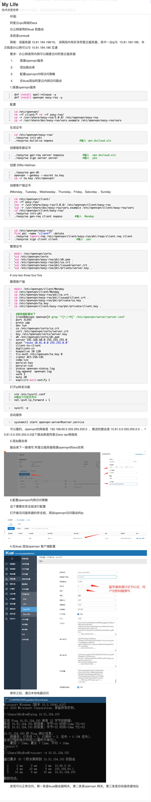

# 搭建vpn, 连接客户端与阿里云vpc教程

## 一. 搭建vpn与客户端

### 参考图片如下:
<table><tr><td>

</td></tr></table>

[图片原链接](https://www.jianshu.com/p/94ca445a508f)

## 二. 设置网络参数

### 参考图片如下:
<table><tr><td>

</td></tr></table>

[图片原链接](https://blog.dvcloud.xin/2020/11/04/%E9%98%BF%E9%87%8C%E4%BA%91ecs-vpc%E7%BD%91%E7%BB%9C%E6%90%AD%E5%BB%BAopenvpn-%E4%B8%8E%E5%8A%9E%E5%85%AC%E7%BD%91%E5%86%85%E7%BD%91%E4%BA%92%E9%80%9A/)

## 三. 注意事项

(1) 图片1 vpn教程比较详细
(2) 图片2 参数设置重要
(3) 两个步骤或有重复
一定注意路由表和安全组的设置

如果您遵循本指南的制作流程而发现有问题或可以改进的流程，请提出 Issue 或 Pull request 。
